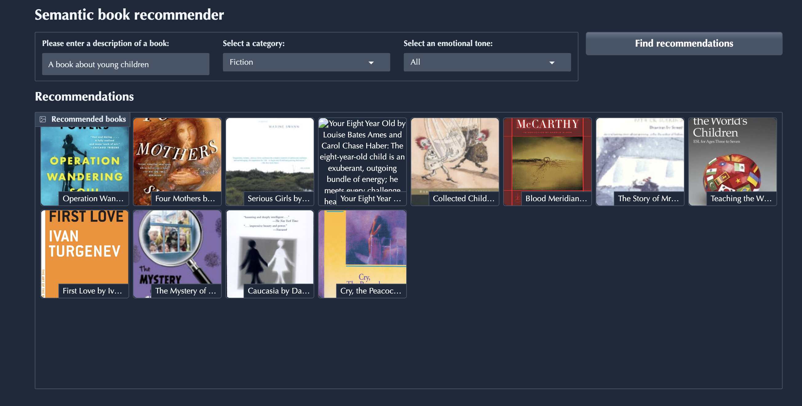

# Semantic Book Recommender

A semantic book recommendation system built with Python, LangChain, Hugging Face, ChromaDB, and Gradio.

The application allows users to describe the type of book they are looking for using natural language and receive relevant book recommendations. Users can also refine recommendations based on book category and emotional tone.



## Overview

Traditional book recommendation systems often rely on explicit metadata such as genre, author, or user ratings. This project uses semantic search to understand the meaning of a user's query and find books with similar descriptions.

For example, instead of searching for a specific genre, a user can enter:

> A story about forgiveness and personal growth

The system converts the query and book descriptions into numerical vector representations (embeddings), stores them in ChromaDB, and retrieves the books that are semantically closest to the query.

The retrieved results can then be filtered by category and sorted according to emotional tone.

## Features

- Natural-language book search
- Semantic similarity search using vector embeddings
- Local Hugging Face embedding model
- ChromaDB vector database
- Book category filtering
- Emotional tone-based ranking
- Book cover images and descriptions
- Interactive Gradio web interface

## Tech Stack

- **Python** - Core programming language
- **Pandas** - Data processing and manipulation
- **NumPy** - Numerical operations
- **LangChain** - Document and embedding workflow
- **Hugging Face** - Local text embedding model
- **Sentence Transformers** - Text embedding generation
- **ChromaDB** - Vector database and similarity search
- **Gradio** - Interactive web interface
- **Jupyter Notebook** - Data exploration and experimentation

## Architecture

The application follows this general workflow:

```text
Book Dataset
     |
     v
Data Cleaning and Exploration
     |
     v
Book Descriptions
     |
     v
Text Documents
     |
     v
Hugging Face Embeddings
     |
     v
ChromaDB Vector Database
     |
     v
Semantic Similarity Search
     |
     +------------------+
     |                  |
     v                  v
Category Filter    Emotional Tone
     |                  |
     +--------+---------+
              |
              v
       Recommended Books
              |
              v
        Gradio Interface
